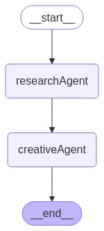

This is a simple monorepo example of express application that uses two remote lang graphs
It uses the following two agents:
- [Research Agent](https://github.com/adijesori/reusable-agents-poc/tree/master/research-agent)
- [Creative Agent](https://github.com/adijesori/reusable-agents-poc/tree/master/creative-agent)

It is using the following workflow:



In order to run it:
1. Clone the repository
2. Run `npm i`
3. Run `npm start `.
4. Use this simple curl (you can import to Postman) to test the application:
```
curl --location 'http://localhost:3000/invoke' \
--header 'Content-Type: application/json' \
--data '{
    "topic": "tennis"
}'
```
5. You can also use the following curl (you can import to Postman) to get the workflow image:
```
curl --location 'http://localhost:3000/graph'
```
